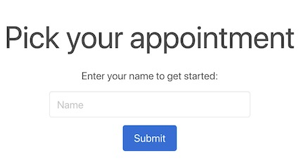
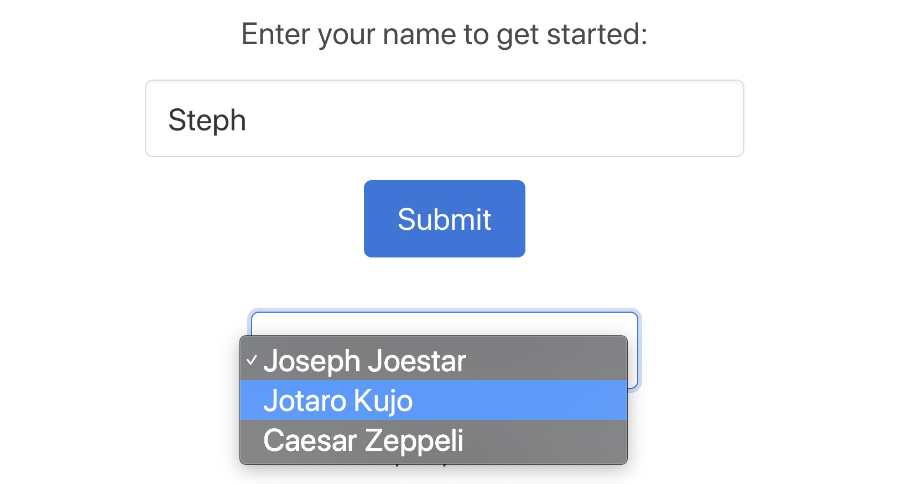
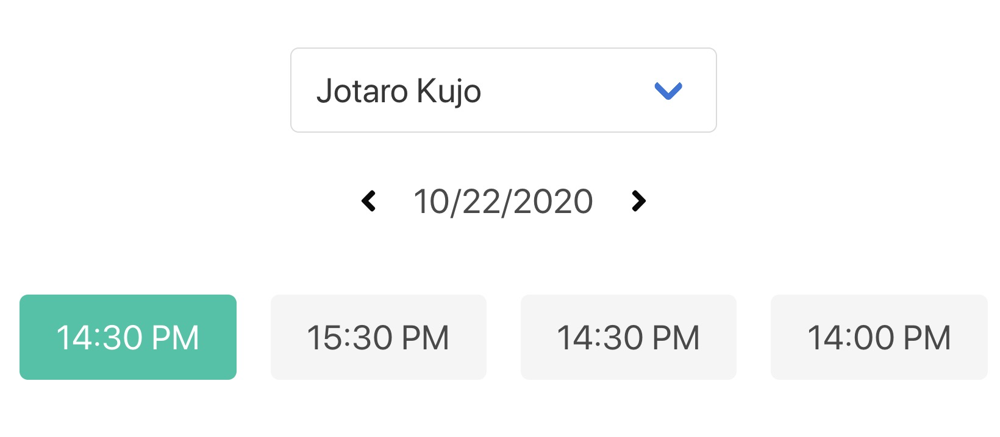
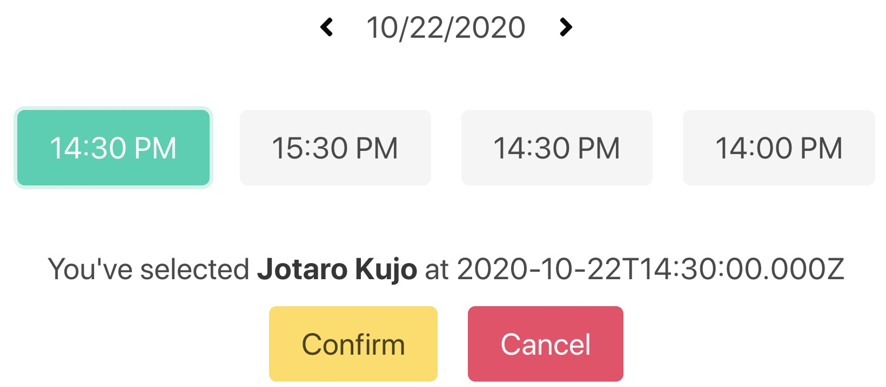

# Modern Appointment Picker

Modern Appointment Picker is exactly as it describes - a series of modular buttons that allow you to effortlessly book appointments in an intuitive way.

## Technologies

This is a fullstack application built on the MERN stack (MongoDB, Express, React, Node.js) in addition to Redux for state management and Bulma as the CSS framework.

## Visuals

   
  
  
  

